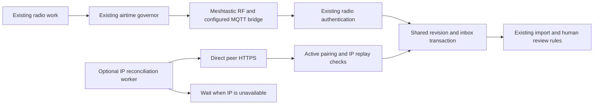

# Local bulk synchronization: #159 design decision

Status: **B1 contract implemented; operational transport remains B2–B6**.
The owner authorized B1 after the design review. The frozen wire, trust, configuration
and storage contract is documented in [Bulk IP protocol v1](BULK-PROTOCOL-V1.md).
The architecture below still defines the requirements for the complete transport.
Reviewed source: `620a5dba41ab66af25cd181bfebcc0a2f02cf2f4`.
The installed application remains `a68baa8f0adb965afbef9b493e9ef8d91d2897fd`.

## Decision

Use **direct peer HTTPS over an explicitly configured local IP network** as the
candidate for a future optional bulk path. Keep the existing Meshtastic carrier
for resident traffic, urgent delivery and bounded ordinary reconciliation. A
failed bulk transfer waits for its IP path; it does not become radio work.

This selects the software architecture to develop, conditional on a usable local
IP link. Operational selection is **deferred**: this session confirms LoRa but
does not yet establish a WAN-independent IP connection between the stations.
There is no measured shared-network capacity envelope from #142 to justify a
new supported-load claim. The current setup remains useful without that link.
Existing signed transfer files provide a separately reviewed manual option.

The owner authorized a concrete design and coding scope under
[#159](https://github.com/baal-bot/Outpost-Meshtastic/issues/159), with software
completion before physical qualification. The implementation tasks below can be
developed using isolated software peers. This document does not select new network
equipment, commission a broker, change radio settings or record a field pass.

## Deployment assumptions and alternatives

The Pi's existing solar battery and the radio's independent battery remain the
power baseline. A router, switch, access point, bridge or broker on a future IP
route has its own power and availability dependency. The inter-station IP route
is unconfirmed. Internet-based VPNs, public DNS, public brokers and cloud
authentication are not assumed available during an outage.

| Option | Behavior with public WAN unavailable | Dependencies and tradeoffs | Disposition |
| --- | --- | --- | --- |
| Direct peer HTTPS on an existing local LAN or routed local link | Can work while that complete local path remains powered and reachable | Explicit peer addresses, local routing, private certificate trust and endpoint maintenance; no central broker. Terrain and line of sight matter if the underlay is wireless. | Preferred software candidate; deploy only on a confirmed local path. |
| Dedicated application MQTT on a local broker | Can work if every participating Pi can reach the powered local broker | Broker operation, credentials/ACLs, expiry, storage and recovery become additional dependencies. Topics must be separate from Meshtastic bridge topics. Broker acceptance is not peer storage. | Viable alternative if a managed local broker becomes a deployment requirement; not selected for the first implementation. |
| Meshtastic MQTT bridge pointed at a local broker | Can bridge mesh packets if the radios or supported clients have a working IP route to that broker | Existing firmware/client uplink and downlink behavior, channel policy and RF rebroadcast still apply. It does not provide Outpost with an independent application bulk queue. | Retain existing integration and #44's separate fallback work; do not call it RF-free bulk transport. |
| Public broker or a remote broker reached through public internet | Unavailable when its public network route is lost | External routing, service availability and often external name resolution/authentication | Supplemental connectivity only. |
| Signed `.opb` pages carried on media or an available local LAN | Works without a live inter-station network once both stations have the required identity and trust setup | Existing eight-record pages, explicit review and finite receipt storage; signed files are not encrypted | Available manual transfer software under #143. Do not automate its approval endpoints or treat it as an unrestricted background protocol. |
| Another logical LoRa channel/application port | Shares the same radio resources | The same modem/frequency slot and shared airtime; changing a label does not create another bearer | Not a bulk-capacity solution. |

Meshtastic documents its configurable broker and per-channel uplink/downlink
bridge in the [MQTT module reference](https://meshtastic.org/docs/configuration/module/mqtt/).
Its [channel documentation](https://meshtastic.org/docs/configuration/tips/#chat-channels-and-lora-frequency-slots)
explains that secondary messaging channels share the primary modem configuration
and frequency slot. The alternatives above are design inferences from those
properties and the source audit below, not measurements of this deployment.

## What the existing code provides

| Area | Observed contract | Consequence for the new path |
| --- | --- | --- |
| `transport/radio_link.py`: `_send_data`, `configure_mqtt` | Outbound data goes to the Meshtastic interface; MQTT controls write firmware configuration. `via_mqtt` records an inbound observation. | Add a separate application transport; MQTT configuration and a topology label cannot select it. |
| `app.py`: `_queue_federation_frames`, `_send_federation_value` | Federation uses durable governor admission and the mesh broadcast carrier. Sending also depends on radio identity and existing peer liveness. | Keep these RF entry points unchanged. IP needs its own supervised worker, identity availability and current authenticated path health. |
| `fed/topology.py`: `_peer_overview` | `preferred_path` is derived from observed inbound traffic/discovery. | It is not an outbound route selector or proof of RF reachability. New status must distinguish observed and selected paths. |
| `fed/peers.py`: `next_counter`, `accept_counter` | One persistent transmit/receive counter per paired peer; lower/equal receive counters are rejected. | A faster IP stream must not consume the radio counter namespace. Pairing/key replacement must revoke both paths. |
| `fed/framing.py` | Complete RF fragments are bounded to 188 bytes, with at most eight fragments. Compression is a radio-format detail. | Keep the RF codec/ceiling intact. Define a separately versioned, bounded IP message format. |
| `fed/revisions.py`, `fed/reconciliation.py` | Producer lineage/revisions, scoped indexed pages and durable pending-page state prevent cursor skips. | Reuse record identity, indexing and acceptance rules. Give each transport its own progress/checkpoint so one cannot advance another's unfinished page. |
| `fed/sync.py`, `fed/review.py` | Domain import, current policy, quarantine and version-bound human review own the effects of received content. | Extract/reuse a transaction-owned ingress operation; do not create a second importer or turn storage into human approval. |
| `fed/bundles.py`, `recovery_fence.py` | Commissioned radio-off identity, current trust and restore fencing already have explicit rules. | Reuse those ownership rules. A restored clone or newly observed endpoint cannot acquire serving identity or transfer authority. |

Paths in this table are under `src/outpost/`. The
[source tree at the reviewed commit](https://github.com/baal-bot/Outpost-Meshtastic/tree/620a5dba41ab66af25cd181bfebcc0a2f02cf2f4/src/outpost)
and [synthetic audit summary](benchmarks/BULK-BACKHAUL-DESIGN-2026-09-09.json)
identify the inspected code.

A temporary SQLite database using the real `FederationPeerService` accepted
counter 2, then rejected delayed counter 1 and duplicate counter 2. That is
expected radio replay protection. Sending a new fast stream through that same
counter would create an ordering conflict; this is a constraint on the proposed
extension, not a newly demonstrated defect in the installed radio path.
The existing codec also rejected an incompressible 2,048-byte synthetic value.

The repository's default airtime model estimates **1.828864 seconds** for a
188-byte LONG_FAST frame on private port 260. The default federation allocation
is **28.8 seconds/hour**, enough for **15 whole frames** before control traffic,
retries and relaying. This is an illustrative per-Outpost software budget, not a
measured community capacity, firmware airtime measurement or guaranteed transfer
rate. The configured cycle allowance of 20 items is not a promise to transmit
20 items per hour. #142 owns the measured shared-capacity envelope.

## Proposed transport contract

This section defines requirements for the complete transport. B1 now supplies the
message and storage primitives; shared domain ingress, TLS, scheduling and UI remain.

### Scope and identity

V1 carries eligible `board:SLUG`, `incidents` and `incident_updates` records from
the original producer. Plain notes still require their original parent and
negotiated note support. Current global module, board, geographic and per-peer
sharing rules apply at export and receipt. Private mail, welfare/member data,
accounts, keys, maps/models, database backups and arbitrary files are outside
this bulk protocol. Existing urgent incident delivery, alerts and other radio
services retain their own paths and policies.

The record identity remains `(origin, stream, uid, epoch, revision, digest)` across
RF, IP and signed files. An IP transfer cannot redact a record while keeping its
old digest, give a replica a new producer identity, resurrect a retained rejection,
or let an older/equal conflicting revision overwrite a newer one. Existing
per-peer item quotas are shared across ingress paths; IP byte limits are additional.

Provision a disabled-by-default peer endpoint explicitly through an authenticated,
audited operator action. Initial pairing and out-of-band verification use the
existing workflow. An unsigned HELLO, MQTT observation, mDNS announcement, peer
name or received content must never grant trust, configure a URL or prove a route.
Radio-off operation requires the existing commissioned identity and an unfenced
runtime; reading an old radio ID from a backup is insufficient.

### Local HTTPS and authentication

Use a dedicated optional peer listener and client, rather than exposing bulk
operations through the current trusted-HTTP operator API. Bind an explicitly
configured local interface. Use standard certificate/hostname verification with
an explicitly installed private trust root and an operator-bound peer public-key
pin. Certificate provisioning and renewal must work without public ACME, public
DNS or cloud login. Key/pin changes require current operator authority and must
cancel or revalidate in-flight work. An unusable clock or invalid/expired
certificate pauses IP transfer; certificate checks must not be disabled to obtain
an offline pass. Application revision ordering remains independent of wall time.

Initially use explicit approved IP endpoints with an expected certificate identity.
Disable redirects and environment proxies. Reject unapproved destinations and
multicast/broadcast/link-local metadata endpoints; loopback is for the isolated
test configuration. A private address alone does not prove WAN independence.
Local DNS or discovery can later provide suggestions, with explicit address/trust
binding and revalidation before connecting.

Every request and response also proves current active pairing through a new
domain-separated application authentication context. Use established library
primitives, not a custom encryption scheme. Specify canonical encoding, exact
authenticated bytes, key derivation and cross-implementation vectors in task B1
before adding network acceptance. Bind at least the protocol version, operation,
source, destination, pairing generation, IP sequence, transfer/request ID and
payload digest; responses bind the request digest and exact storage outcome.
The bulk listener accepts only the bulk protocol, never generic MeshPackets or
arbitrary radio commands.

IP has its own durable replay state per pairing generation and direction. It does
not increment `fed_peer.tx_counter` or advance `fed_peer.rx_counter`. Unpairing,
re-pairing and restored identity fencing invalidate IP authority. The last accepted
operation's exact response is recoverable for a matching retry; a reused identifier
with a different digest is rejected. Domain revision receipts remain shared so
cross-path duplicates cannot repeat an import or incident action.

### Durable receipt, review and recovery

A receiver transaction rechecks current pairing, policy, lineage, quotas and
identity fence, then commits the domain inbox/revision receipt, IP operation
receipt and accepted replay state together. Network I/O and operator review
happen outside the database writer. A storage receipt means committed storage;
it is not a promise of human approval, responder notification or continued remote
retention. Normal automatic board eligibility and existing incident/note review
rules remain in force. Importing a record cannot authorize an alert broadcast or
responder assignment.

Persist the requested snapshot/page and transfer identity before sending. After
a disconnect or ambiguous timeout, retry/query that same operation; advance the
transport's page cursor only after validating its exact committed receipt. Failures
remain visible by peer and record. Scope changes reset/revalidate the affected
work; producer-lineage changes and recovery rollback require existing review.
An already pending RF record and a newer IP revision must converge without
clearing durable RF work blindly or dropping a valid receipt for unrelated work.

Keep the bulk work store separate from `outbound_work`, whose meanings and budgets
are radio-specific. Imported bulk content must not generate an immediate RF
fan-out merely because it arrived over IP. Ordinary radio reconciliation continues
to select eligible work through its existing schedule, quotas and governor.

### Limits, isolation and fallback

These are proposed initial software limits, to be verified and adjusted from
software evidence before publishing supported operating limits:

| Resource | Initial limit/behavior |
| --- | --- |
| Outbound concurrency | One bulk worker, one active request; fair rotation among eligible peers. |
| Inbound concurrency | One admitted bulk operation globally, with bounded waiting and a retryable busy response. |
| Page and body | At most eight records, 12,000 encoded bytes per record and 192 KiB per message; reject excess while streaming, before parsing. No compression or archive extraction. |
| Work per visit | At most the existing configured `fed.max_items_per_cycle` (default 20) and bounded indexed scans; byte and time limits also apply. |
| Throughput | Initial aggregate 64 KiB/s application limit per direction, with at most one message-sized burst; this is a throttle, not measured throughput. |
| Timeouts | Three-second connect, ten-second inactivity and thirty-second absolute operation deadline; monotonic scheduling. |
| Retry | Five attempts per persisted operation with capped exponential backoff and jitter; then a visible paused state and explicit retry. Restart must not replenish attempts. |
| Durable work/receipts | B1 fixes 32 peer states, one pending request and last response per peer, and an 8 MiB aggregate message cap. Only a subsequent contiguous request permits replacement of the prior response; same-key pauses retain replay history. Additional B4 queue/checkpoint metadata must also be finite. |
| Resource denial | Pause optional bulk work promptly on configured resource denial; keep the writer lock short and preserve ordinary intake. |

When IP fails, the bulk worker stops its attempt and persists `waiting_for_ip`,
`retry_wait`, `paused` or the specific terminal reason. It must never call
`_queue_federation_frames` as an error fallback, raise radio budgets, borrow an
emergency reserve or fragment an oversized IP item onto LoRa. Existing radio work
continues independently within its current limits. Restoring IP resumes bounded
work from durable checkpoints; it does not launch an all-history flood.

Diagnostics distinguish configured endpoint, authenticated IP health, observed
RF/MQTT traffic, selected bulk path, requested work, committed remote storage and
human review. Report byte counts, retry/expiry counts, queue depth, age and fixed
failure reasons. Keep credentials, certificate private keys, content and precise
network/location details out of public summaries. UI labels must not report
"delivered" at socket write or HTTP admission.

## Implementation sequence

These are local task specifications, not newly published GitHub issues. **B1 is
implemented and B2 is next.** Runtime transport integration remains separately scoped.
All tasks use synthetic stores and local software peers before later field checks.

| Task | Concrete change and likely ownership | Required acceptance evidence |
| --- | --- | --- |
| **B1 — Freeze the IP protocol and trust contract** | Define versioned bounded request/response schemas, canonical authentication vectors, per-generation IP replay/operation identity, receipt semantics and finite ledger caps. Add explicit endpoint/certificate/pin configuration and migration design. Owners: new `fed/bulk_format.py`, `fed/bulk_policy.py`, `config.py`, a new forward migration. | Correct, tampered, oversized, cross-peer, wrong-generation and wrong-operation messages; exact retry vs changed digest; radio counter 1 still accepted after independent IP counter 2; old configuration stays disabled; migration preserves all existing records. |
| **B2 — Share transaction-owned ingress** | Extract the existing eligible revision/inbox acceptance into a shared service for RF and future IP. Retain `RevisionIndex`, `FederationSyncService` and current review ownership. Add atomic IP receipt/replay updates under that same writer. | RF/IP/file duplicates, changed policies during waits, parent/note order, newer/older/equal conflicting revisions, prior rejection, quota races, rollback before commit and lost response after commit. Existing RF tests remain green. |
| **B3 — Implement the dedicated HTTPS boundary** | Add an optional listener/client using the repository's HTTP stack, strict endpoint policy, verified private trust and active-peer authentication. Integrate commissioned identity and recovery fences. | Two real local TLS endpoints with public networking unavailable; wrong certificate/pin/peer, redirects/proxies, slow/oversized input, unavailable clock, unpair/rekey during I/O, fenced restore and unavailable listener. No live radio or production store is needed. |
| **B4 — Add durable pull reconciliation** | Add the supervised bulk worker, separate durable work/checkpoints, bounded indexed pages, shared content quotas, fair scheduling and finite retries. Keep the legacy radio scheduler independent. | Partition/reconnect, restart at every commit/receipt boundary, duplicate/reordered responses, missing parents, lineage reset, full ledger, continuous backlog and changing permissions. An IP failure creates zero fallback RF work; PING/POST/SEND/urgent intake remain usable with bulk disabled, busy or failed. |
| **B5 — Expose configuration and honest status** | Add named-operator controls and a per-peer bulk status section; extend topology/diagnostics with explicitly different selected/observed/stored/reviewed states. | Authentication/CSRF and current-authority checks, endpoint/pin change review, keyboard/mobile behavior, redacted output and stale/failed fetch handling. No claim of RF reachability from IP or MQTT observations. |
| **B6 — Qualify and document the software candidate** | Run an isolated three-peer backlog/fault scenario through real TLS, stores, policies and UI; update configuration, requirements/capability evidence and installer/offline-kit asset inventory. | Exact-source CI, mixed versions with bulk disabled for unsupported peers, finite load/byte/memory/latency results and record preservation. Publish measured software limits and identify later physical checks separately. |

Dependency order: **B1 → B2 → B3 → B4 → B5 → B6**. B1 must settle the wire
contract and finite storage lifecycle before adding a listener. A new broker,
arbitrary file transfer, automatic private replication and a network-equipment
purchase are outside these tasks.

## Evidence and #159 disposition

The current source audit and isolated probes establish implementation constraints,
not a working IP transport. Existing exact-source CI for the installed application
is [34402429284](https://github.com/baal-bot/Outpost-Meshtastic/actions/runs/34402429284).
The original design commit changed no application code or live service. Its audit used temporary
synthetic SQLite data, real replay/codec code and the repository airtime model;
its [summary](benchmarks/BULK-BACKHAUL-DESIGN-2026-09-09.json) records source hashes.
The matching counter behavior is also covered by
`tests/integration/test_federation_peers.py::test_counters_persist_and_replays_are_rejected`.
That existing regression passed during this review. The pre-push formatting,
typing-ratchet, command, requirement and static-markup gates passed; generated
capability documentation is current. All nine reported source hashes and 73 local
links in the decision and related updated guides were checked. No new transport
or field test result is claimed.

| Original criterion | Disposition |
| --- | --- |
| Identify paths surviving WAN loss; do not infer RF reachability from MQTT discovery | Design documented above, conditional on the actual local route and its dependencies. |
| Demonstrate a selected local path and bounded reconnect/fallback | Operational selection is deferred. B3/B4/B6 provide software evidence; later physical qualification reuses #44 where applicable. |
| Prevent peer-policy bypass and silent LoRa flooding | Mandatory B2/B4 behavior with explicit regression cases; not claimed implemented by this document. |
| Document limits and scope approved implementation separately | Initial limits and B1–B6 are ready for review. Keep public implementation issues and activation separate from this design record. |

#159 remains open. Confirmation of a shared LAN or local routed link can select a
deployment option without requiring the owner to repeat power or antenna tests.
If only LoRa is available, retain the explicit IP deployment deferral and the
existing radio/manual-transfer paths. Software work can continue without claiming
that a missing physical IP route exists.
